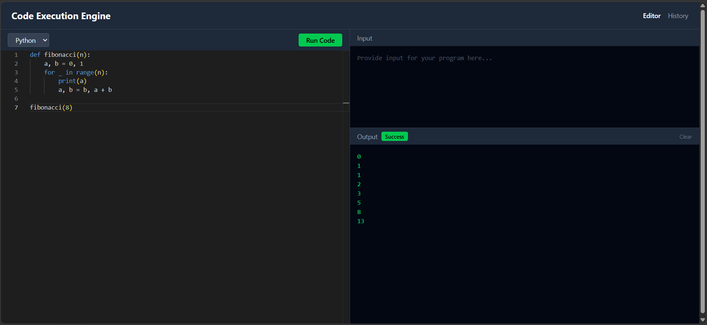
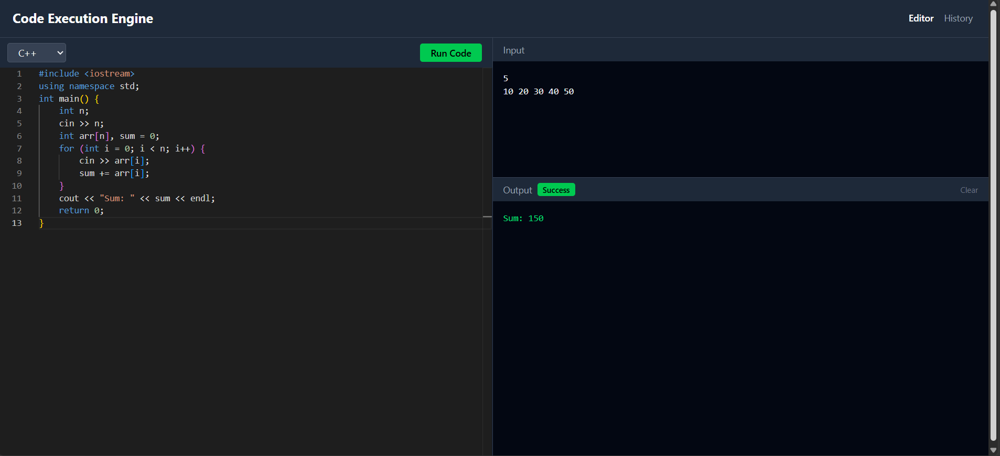
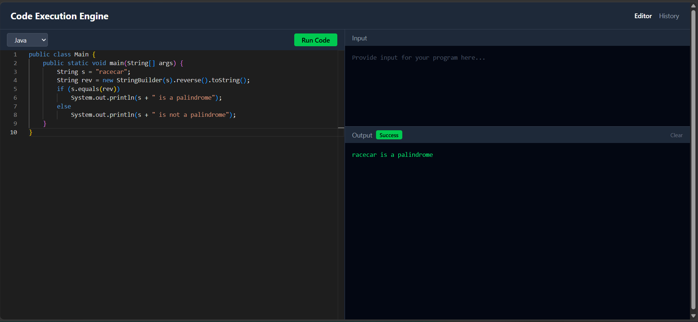
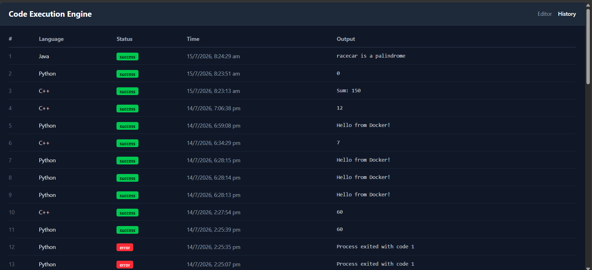
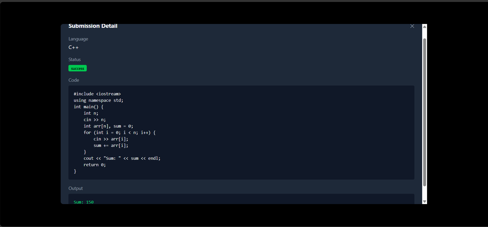
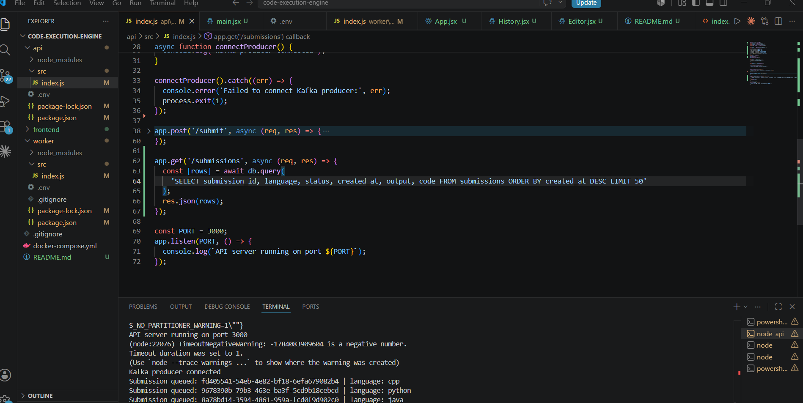
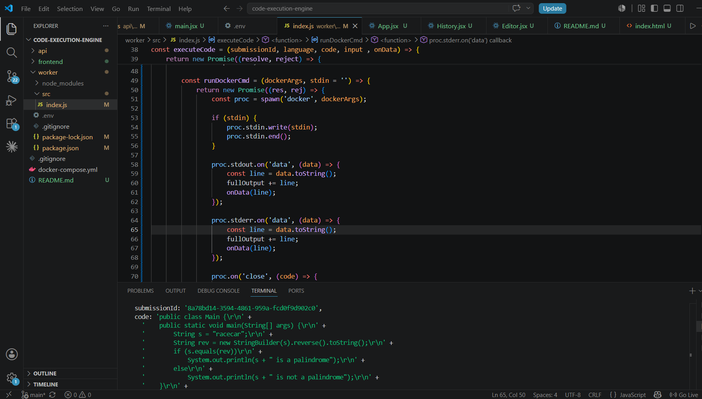

# Code Execution Engine

A production-grade code execution engine that replicates the "Run Code" functionality of platforms like LeetCode and HackerRank. Users write code in a browser-based editor, submit it, and see the output streamed back in real time — all while the code runs in a fully isolated Docker container.

---

## Screenshots

### Editor — Python (Fibonacci sequence, real-time streaming output)


### Editor — C++ (Array sum with stdin input)


### Editor — Java (Palindrome check)


### Submission History — Browse all past submissions


### Submission Detail Modal — Full code and output on click


### API Terminal — Kafka producer logging queued submissions


### Worker Terminal — Kafka consumer processing submissions in real time


---

## System Architecture

```
User (Browser)
     │
     │  HTTP POST /submit
     ▼
┌─────────────────┐
│   Express API   │  ← Node.js + Express (Port 3000)
│   (Producer)    │
└────────┬────────┘
         │  Publishes to Kafka topic: "submissions"
         ▼
┌─────────────────┐
│  Kafka + ZK     │  ← Message queue (Port 9092)
└────────┬────────┘
         │  Worker consumes from topic
         ▼
┌─────────────────┐
│  Worker Service │  ← Node.js (Kafka Consumer + WebSocket Server)
└────────┬────────┘
         │  Spins up isolated container
         ▼
┌─────────────────┐
│ Docker Container│  ← Throwaway sandbox per submission
│  (runs code)    │    CPU: 0.5 cores | Memory: 128MB | Network: none
└────────┬────────┘
         │  stdout/stderr captured line by line
         ▼
┌─────────────────┐
│     MySQL       │  ← Stores submission_id, language, code, output, status
└─────────────────┘
         │
         │  WebSocket streams output in real time
         ▼
┌─────────────────┐
│  React Frontend │  ← Monaco Editor + Live output terminal (Port 5173)
└─────────────────┘
```

---

## Features

- **Real-time output streaming** — output appears line by line as the code runs, via WebSocket
- **Isolated execution** — every submission runs in a throwaway Docker container, completely isolated from the host
- **Resource limits** — hard CPU (0.5 cores), memory (128MB), and network restrictions per container
- **Concurrent submissions** — Kafka queue handles multiple simultaneous submissions safely
- **stdin support** — users can provide custom input that gets passed to the program via `input.txt`
- **Submission history** — all submissions stored in MySQL with language, status, output, and timestamp
- **Multi-language support** — Python, Java, C++ (adding a new language only requires a new Docker image)
- **Monaco editor** — the same editor that powers VS Code, embedded in the browser

---

## Tech Stack

| Layer | Technology | Purpose |
|---|---|---|
| Frontend | React + Vite + Tailwind CSS v4 | UI framework |
| Editor | Monaco Editor (`@monaco-editor/react`) | VS Code-style browser editor |
| API | Node.js + Express | Receives submissions, exposes history endpoint |
| Queue | Apache Kafka + Zookeeper | Decouples submission intake from execution |
| Execution | Docker | Isolated sandbox per submission |
| Database | MySQL | Stores all submission results |
| Real-time | WebSocket (`ws` package) | Streams output line by line to browser |
| Infrastructure | Docker Compose | Orchestrates Kafka, Zookeeper, MySQL locally |

---

## Why These Technologies?

**Why Kafka?**
A simple HTTP request to the worker would break under load — if 100 users submit at once, 100 Docker containers would spin up simultaneously, crashing the server. Kafka acts as a buffer. Submissions are queued and the worker processes them at a controlled rate. The worker pool is horizontally scalable — just run more worker instances.

**Why Docker?**
User-submitted code is untrusted. It could be an infinite loop, a memory bomb, or a command that deletes files. Docker provides complete isolation — each submission gets a throwaway container with hard resource limits and no network access. The container is destroyed immediately after execution.

**Why WebSocket?**
HTTP is request-response — you ask, you wait, you get one answer. WebSocket is a persistent connection that allows the server to push data to the client at any time. This enables true real-time streaming: output lines appear in the browser as the program runs, not after it finishes.

---

## Project Structure

```
code-execution-engine/
├── docker-compose.yml          # Kafka, Zookeeper, MySQL
├── api/
│   ├── src/
│   │   └── index.js            # Express API — /submit and /submissions routes
│   ├── .env                    # MySQL credentials
│   └── package.json
├── worker/
│   ├── src/
│   │   └── index.js            # Kafka consumer + Docker execution + WebSocket server
│   ├── .env                    # MySQL credentials
│   └── package.json
└── frontend/
    ├── src/
    │   ├── pages/
    │   │   ├── Editor.jsx      # Monaco editor, input panel, live output
    │   │   └── History.jsx     # Submission history table + detail modal
    │   ├── App.jsx             # React Router routes
    │   └── main.jsx            # BrowserRouter entry point
    └── package.json
```

---

## Getting Started

### Prerequisites

- Node.js v18+
- Docker Desktop (must be running)
- MySQL (local instance)

### 1. Clone the repository

```bash
git clone https://github.com/Anuj8506/Code-Execution-Engine.git
cd code-execution-engine
```

### 2. Start infrastructure (Kafka + Zookeeper + MySQL)

```bash
docker-compose up -d
```

### 3. Set up environment variables

Create `.env` in both `api/` and `worker/` folders:

```env
MYSQL_HOST=localhost
MYSQL_USER=root
MYSQL_PASSWORD=your_password
MYSQL_DATABASE=code_engine
MYSQL_PORT=3306
```

### 4. Create the MySQL database and table

```sql
CREATE DATABASE code_engine;

USE code_engine;

CREATE TABLE submissions (
  id INT AUTO_INCREMENT PRIMARY KEY,
  submission_id VARCHAR(255) NOT NULL,
  language VARCHAR(50) NOT NULL,
  code TEXT NOT NULL,
  output TEXT,
  status VARCHAR(50) NOT NULL,
  created_at TIMESTAMP DEFAULT CURRENT_TIMESTAMP
);
```

### 5. Install dependencies

```bash
cd api && npm install
cd ../worker && npm install
cd ../frontend && npm install
```

### 6. Start all services

Open three terminals:

```bash
# Terminal 1 — API
cd api && node src/index.js

# Terminal 2 — Worker
cd worker && node src/index.js

# Terminal 3 — Frontend
cd frontend && npm run dev
```

### 7. Open the app

Visit `http://localhost:5173`

---

## Supported Languages

| Language | Docker Image | Compile Step |
|---|---|---|
| Python | `python:3.11-slim` | None |
| Java | `eclipse-temurin:21-jdk` | `javac` |
| C++ | `gcc:12` | `g++` |

Adding a new language only requires adding a new entry to `LANGUAGE_CONFIG` in `worker/src/index.js` — nothing else changes.

---

## Key Engineering Decisions

- **WebSocket server lives in the worker**, not the API — because the worker directly observes Docker output. Routing through the API would add an unnecessary hop and complicate the architecture.
- **stdin via `input.txt`** — Docker's `-i` flag causes hanging on Windows. Instead, input is written to a temp file and redirected with `< /code/input.txt` inside the container.
- **`spawn` without shell** — Windows `cmd /c` mangles quotes in Docker arguments. Using `spawn` with Docker called directly as an argument array avoids this.
- **`python3 -u`** — Python buffers stdout inside Docker by default. The `-u` flag disables buffering, enabling real-time line-by-line streaming.
- **Kafka consumer group** — the worker uses a consumer group (`code-execution-workers`), so multiple worker instances can run in parallel and Kafka distributes submissions between them automatically.

---

## Build Phases

| Phase | Description |
|---|---|
| 1 | Folder structure + Docker Compose (Kafka, Zookeeper, MySQL) |
| 2 | Kafka producer — API receives submission and publishes to topic |
| 3 | Kafka consumer — Worker picks up submission from queue |
| 4 | Docker sandbox — Worker runs code in isolated container with resource limits |
| 5 | MySQL — Worker saves result and metrics to database |
| 6 | WebSocket — Streams output line by line to browser in real time |
| 7 | React frontend — Monaco editor, language selector, input panel, live output terminal |
| 8 | Submission history page — React Router, history table, submission detail modal |

---

## Author

**Anuj Kumar**  
Final Year, Information Technology  
Delhi Technological University (DTU)  
[GitHub](https://github.com/Anuj8506)